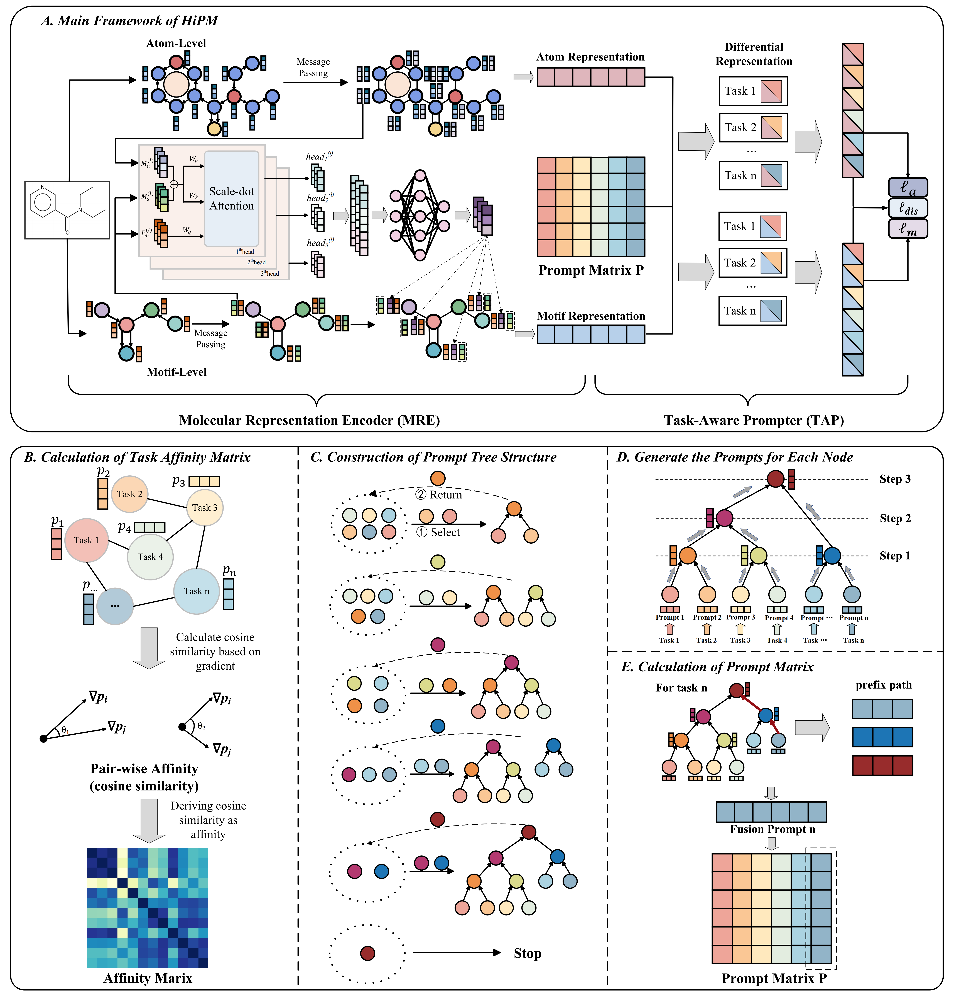

# Adapting Differential Molecular Representation with Hierarchical Prompts for Multi-label Property Prediction

Official Pytorch implementation of the paper: ["Adapting Differential Molecular Representation with Hierarchical Prompts for Multi-label Property Prediction"](https://academic.oup.com/bib/article/25/5/bbae438/7754116).

## Overview of the Framework

HiPM is an innovative hierarchical prompted multi-label molecular representation learning framework designed to effectively manage the complexities of multi-label molecular property prediction. This framework comprises two main components: the Molecular Representation Encoder (MRE) and the Task-Aware Prompter (TAP). The novel use of hierarchical prompts within TAP allows our model to learn task-specific prompts while also capturing shared information across multiple tasks. By constructing a hierarchical prompt tree based on task affinity—measured through the angle of gradients—our method uncovers latent associations between molecular labels. This approach mitigates the negative transfer effects often seen in multi-label tasks and enhances model interpretability. Moreover, HiPM adapts to complex multi-label scenarios without requiring extensive task-specific tuning.

## Requirements

- python == 3.10.11
- dgl == 2.0.0.cu116
- dgllife == 0.3.2
- rdkit == 2023.12.25
- torch == 2.0.1

You can run the following commands line by line:

```
conda create -n HiPM python=3.10.11
conda activate HiPM
pip install torch==2.0.1
conda install -c dglteam/label/cu116 dgl
pip install dgllife
pip install rdkit
pip install optuna
```

## Dataset

For the dataset we used,  we have uploaded them to [data](https://github.com/zhousongh/HiPM/tree/main/data/datasets).

## Quick Start

To train a model from scratch, run:

```
python main.py --dataset <datasetname> --device cuda:0 --epoch 200 --mode tune --n_trials 20
```

## Prediction Results

### Classification

| Model | Clintox         | SIDER           | Tox21           | ToxCast         |
| ----- | --------------- | --------------- | --------------- | --------------- |
| HiPM  | $0.928\pm0.014$ | $0.672\pm0.010$ | $0.843\pm0.007$ | $0.786\pm0.004$ |

### Regression

| Model | QM8               | QM9             |
| ----- | ----------------- | --------------- |
| HiPM  | $0.0117\pm0.0001$ | $5.238\pm0.199$ |

We randomly selected three seeds for each experiment with random scaffold splitting, then reported the mean and standard deviation of AUC or MAE values.
